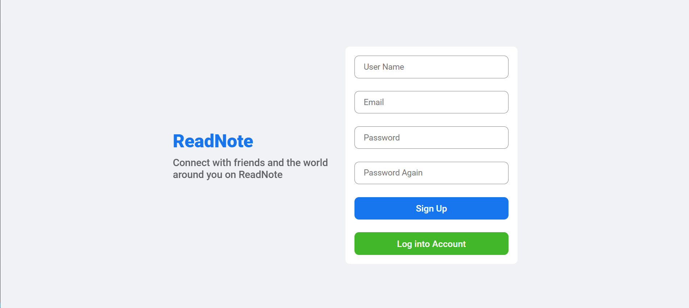
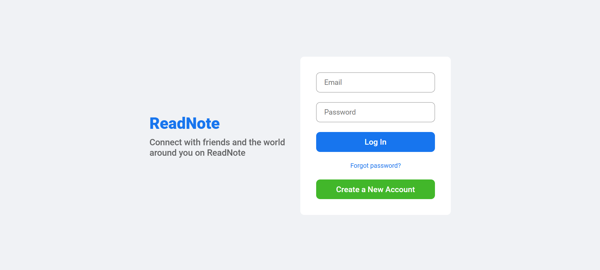
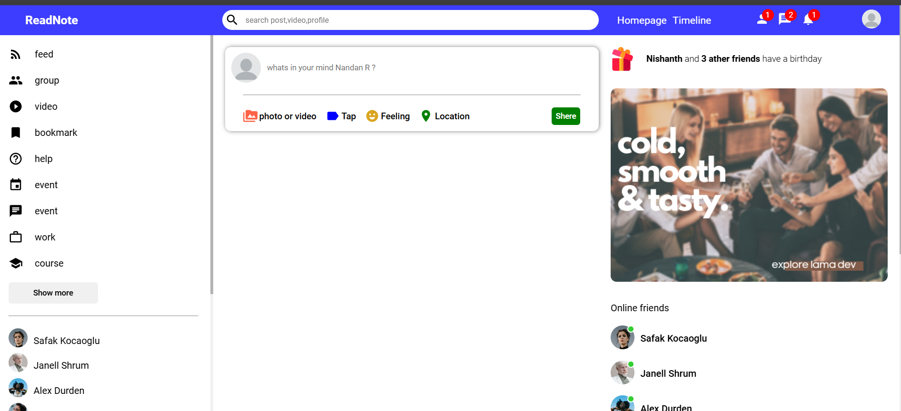
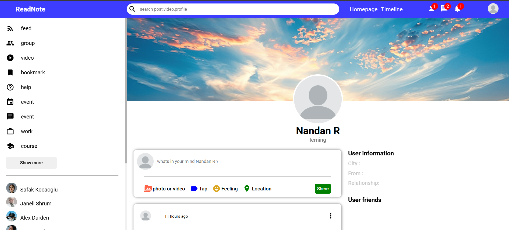
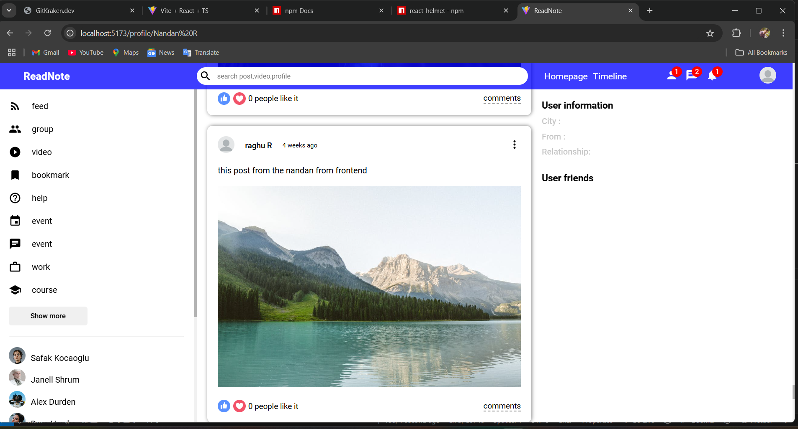

# Social Media App

Welcome to the **Social Media App** repository! This is a MERN stack-based social networking application where users can connect, share, and interact. This application includes core features like follow/unfollow functionality, liking/disliking posts, and profile customization.

## Features

- **User Registration**: Secure and easy-to-use registration process.
- **Follow/Unfollow**: Connect with other users by following or unfollowing them.
- **Post Creation**: Create, edit, and delete posts.
- **Like/Dislike**: Interact with posts using the like or dislike feature.
- **Profile Management**: Customize your profile with a bio and profile picture.
- **User Feed**: View posts from users you follow.

## Tech Stack

### Frontend
- **Language**: JavaScript
- **Framework**: React.js
- **UI Libraries**: Material UI, Bootstrap

### Backend
- **Language**: JavaScript
- **Framework**: Node.js, Express.js
- **Database**: MongoDB
- **Architecture**: RESTful API

## Screenshots

### 1. Register Page


### 2. Login Page


### 3. Home Page


### 4. Profile Page


### 5.Post Page



## How to Run Locally

1. Clone the repository:
   ```bash
   git clone https://github.com/NandanR06/Full-stack-social-media-app.git
   cd social-media-app
   ```

2. Install dependencies:
   ```bash
   npm install
   cd  frontend && npm install
   ```

3. Run the application:
   ```bash
   # Start the backend server
   npm start

   # Start the frontend
   cd backend && npm start
   ```

4. Access the application in your browser at `http://localhost:5000`.

## RESTful API Endpoints

- **Users**:
  - `GET /api/users` - Get a list of users
  - `GET /api/users/:id` - Get user profile by ID
  - `PUT /api/users/:id` - Update user profile
  - `POST /api/users/:id/follow` - Follow a user
  - `POST /api/users/:id/unfollow` - Unfollow a user

- **Posts**:
  - `GET /api/posts` - Get all posts
  - `POST /api/posts` - Create a new post
  - `PUT /api/posts/:id` - Update a post
  - `DELETE /api/posts/:id` - Delete a post
  - `POST /api/posts/:id/like` - Like a post
  - `POST /api/posts/:id/dislike` - Dislike a post

## Contributing

Contributions are welcome! Please follow the guidelines:

1. Fork the repository.
2. Create a feature branch.
3. Commit your changes.
4. Submit a pull request.


